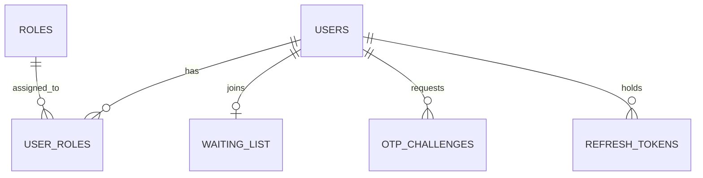

# FarmIT database schema

PostgreSQL is the only source of truth. Flyway owns schema changes. Hibernate `ddl-auto` is `validate`.

**Rule:** do not add domain tables until the Phase 1 endpoints in [api-contract.md](./api-contract.md) exist. Farms, diagnoses, weather, Daily, and gamification stay out of `V1`.

The one exception: **`diagnosis_catalog` and `diagnosis_products` are specified now** so matching never uses a `target_diagnosis` string. They are **not** created in `V1`. They land with the input catalogue in Phase 5.

---

## V1 — create these tables

`src/main/resources/db/migration/V1__identity_and_waiting_list.sql`

All primary keys are UUID, default `gen_random_uuid()`. Timestamps are `TIMESTAMPTZ`.

### users

Farmer default is phone OTP. `password_hash` is nullable. Email/password is for admins (and later agro businesses).

| Column | Type | Constraints |
| :--- | :--- | :--- |
| id | UUID | PK |
| phone | VARCHAR(20) | UNIQUE NOT NULL — E.164 (`+263…`) |
| email | VARCHAR(255) | UNIQUE, nullable |
| password_hash | VARCHAR(255) | nullable |
| status | VARCHAR(20) | NOT NULL, default `PENDING` — `PENDING`, `ACTIVE`, `SUSPENDED`, `DELETED` |
| last_login_at | TIMESTAMPTZ | nullable |
| created_at | TIMESTAMPTZ | NOT NULL, default `now()` |
| updated_at | TIMESTAMPTZ | NOT NULL, default `now()` |

Indexes: unique `phone`; unique `email` where email is not null.

Public `POST /waiting-list/open` creates the user if the phone is new. Authenticated OTP verify can still create the user. The waitlist body sends `applicantType` (`FARMER` or `AGRONOMIST`; default `FARMER`). New users get that role and status `PENDING`. Status becomes `ACTIVE` when an admin approves the waiting-list row.

### roles

| Column | Type | Constraints |
| :--- | :--- | :--- |
| id | UUID | PK |
| name | VARCHAR(50) | UNIQUE NOT NULL |

Seed (V2): `FARMER`, `AGRO_BUSINESS`, `ADMIN`. V3 adds `AGRONOMIST`.

### user_roles

| Column | Type | Constraints |
| :--- | :--- | :--- |
| user_id | UUID | PK, FK → users ON DELETE CASCADE |
| role_id | UUID | PK, FK → roles ON DELETE CASCADE |

### otp_challenges

| Column | Type | Constraints |
| :--- | :--- | :--- |
| id | UUID | PK |
| phone | VARCHAR(20) | NOT NULL |
| code_hash | VARCHAR(255) | NOT NULL |
| expires_at | TIMESTAMPTZ | NOT NULL |
| attempt_count | INTEGER | NOT NULL, default 0 |
| consumed_at | TIMESTAMPTZ | nullable |
| created_at | TIMESTAMPTZ | NOT NULL, default `now()` |

Index: `(phone, created_at DESC)`. Store a hash of the code, not the code. TTL five minutes.

### refresh_tokens

| Column | Type | Constraints |
| :--- | :--- | :--- |
| id | UUID | PK |
| user_id | UUID | FK → users ON DELETE CASCADE |
| token_hash | VARCHAR(255) | UNIQUE NOT NULL |
| expires_at | TIMESTAMPTZ | NOT NULL |
| revoked_at | TIMESTAMPTZ | nullable |
| created_at | TIMESTAMPTZ | NOT NULL, default `now()` |

### waiting_list

One row per user. A waiting-list farmer is a real `users` row — there is nothing to migrate later.

| Column | Type | Constraints |
| :--- | :--- | :--- |
| id | UUID | PK |
| user_id | UUID | UNIQUE NOT NULL, FK → users ON DELETE CASCADE |
| name | VARCHAR(255) | NOT NULL |
| phone | VARCHAR(20) | NOT NULL |
| email | VARCHAR(255) | nullable |
| location | VARCHAR(255) | nullable — district / area text for Phase 1 |
| farming_type | VARCHAR(100) | nullable — farmers only; agronomists leave this empty |
| applicant_type | VARCHAR(20) | NOT NULL, default `FARMER` — `FARMER` or `AGRONOMIST` (V3) |
| status | VARCHAR(20) | NOT NULL, default `PENDING` — `PENDING`, `APPROVED`, `REJECTED` |
| notes | TEXT | nullable — admin only |
| reviewed_by | UUID | FK → users, nullable |
| reviewed_at | TIMESTAMPTZ | nullable |
| created_at | TIMESTAMPTZ | NOT NULL, default `now()` |
| updated_at | TIMESTAMPTZ | NOT NULL, default `now()` |

Indexes: `status`; `applicant_type` (V3). Approve sets `waiting_list.status = APPROVED` and `users.status = ACTIVE`.

Existing V1 rows receive `applicant_type = FARMER` when V3 runs.

---

## V3 — agronomist waitlist

`src/main/resources/db/migration/V3__applicant_type.sql`

- Insert role `AGRONOMIST`
- Add `waiting_list.applicant_type` with check constraint `FARMER` \| `AGRONOMIST`

---

## Reserved — specify now, migrate in Phase 5

Do not put `target_diagnosis` on `input_products`. One problem maps to many products; one product treats many problems; dose can be crop-specific.

### diagnosis_catalog

Canonical problem types the model (and agronomy) can emit. Farmer `diagnoses` rows (later) FK here. They do not FK to products.

| Column | Type | Constraints |
| :--- | :--- | :--- |
| id | UUID | PK |
| code | VARCHAR(80) | UNIQUE NOT NULL — stable machine name, e.g. `FALL_ARMYWORM` |
| name | VARCHAR(255) | NOT NULL |
| kind | VARCHAR(20) | NOT NULL — `DISEASE`, `PEST`, `DEFICIENCY`, `OTHER` |
| crop_id | UUID | nullable FK → crops — null means any crop |
| description | TEXT | nullable |
| created_at | TIMESTAMPTZ | NOT NULL, default `now()` |

### diagnosis_products

| Column | Type | Constraints |
| :--- | :--- | :--- |
| id | UUID | PK |
| diagnosis_catalog_id | UUID | NOT NULL, FK → diagnosis_catalog ON DELETE CASCADE |
| product_id | UUID | NOT NULL, FK → input_products ON DELETE CASCADE |
| crop_id | UUID | nullable FK → crops — narrower than the catalog crop |
| is_primary | BOOLEAN | NOT NULL, default false |
| sort_order | INTEGER | NOT NULL, default 0 |
| notes | TEXT | nullable — dose / safety later |
| created_at | TIMESTAMPTZ | NOT NULL, default `now()` |

Unique: `(diagnosis_catalog_id, product_id, crop_id)`.

Matching (later) is: diagnosis → `diagnosis_products` → locations that stock those products → rank by distance from the farm. Distance in v1 of matching is Haversine over stored lat/lng, not PostGIS.

---

## Out of V1

Farms, fields, crops, planting cycles, activities, diagnoses, images, agro businesses, inventory, matches, Daily, weather, notifications, gamification, learning, WhatsApp conversations, audit logs, system_config.

They remain described at domain level in the [system specification](./FarmIT_1.0_System_Specification.md). They get Flyway files when those endpoints are being built.
